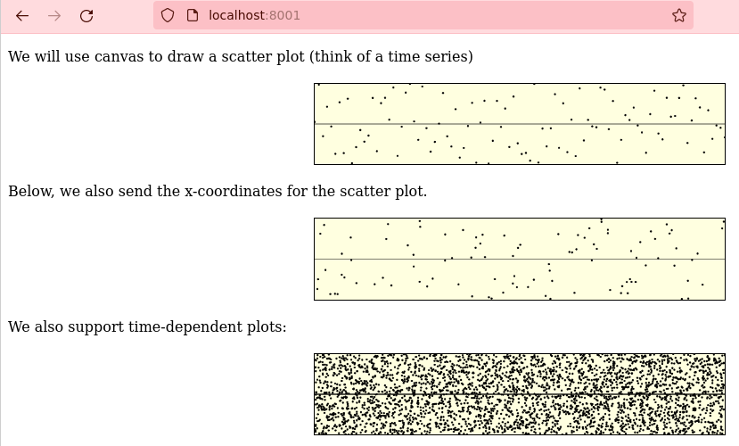

## In-browser plots for Racket

This is a work-in-progress, experimental library that I built mainly for teaching myself scheme and web technology.

The purpose of this library is to provide a way to plot data on the browser, from Racket.

As an example, the following scheme code:
```scheme
`((p "We will use canvas to draw a scatter plot (think of a time series)")
   (canvas ((id "fig-1")))
   (style ,(canvas:style #:width 40 #:height 80))
   (p "Below, we also send the x-coordinates for the scatter plot.")
   (canvas ((id "fig-2")))
   (p "We also support time-dependent plots:")
   (canvas ((id "fig-3")))
   (script ,(js:plot (scatter    'fig-1 #:port 8001)
                     (scatter-2d 'fig-2 #:port 8002)
                     (dynamic
                       (scatter-2d 'fig-3 #:port 8002)
                       (with #:refresh-rate 1000)))))
```
generates the HTML page below:

Where the third plot changes with time.
The only new part is the S-expression starting with `js:plot`.

For a more extensive example, check out the source of `test-scatter.rkt`, and run it with: `racket test-scatter.rkt`, then open the url `localhost:8000` with your browser.

At some point I would also like to port this library to rnrs Scheme. A first prototype (using Guile) is in `test.scm`.

### References
- [Guide to the canvas API](https://developer.mozilla.org/en-US/docs/Web/API/Canvas_API)
- [Canvas deep dive](https://joshondesign.com/p/books/canvasdeepdive/toc.html)

### To do
- If there is any attribute in a canvas tag that is given a style, such as:
```scheme
(canvas ((id "fig-1") (width "300") (height "200")))
(style ,(canvas:style #:id "fig-1"))
```
then any call to `js:plot` should be aware of the properties of the
`"fig-1"` element and add a `width` and `height` attribute to the style.
- Think about whether we should allow a `begin` clause to open a new scope.
- Provide a way to use `gensym` to translate symbol names.
- Write some notes on the different ways to generate a syntax element from a string and vice versa.
- Now `method-call` is never used because of an incompatibility with `cdsl:expr` so we use `object-property` instead as a workaround. This should be fixed.
- We need to implement `eq?` and `null?` so that we could write `(if (null? y) ...)` that translates to: `if (y === undefined) ...`
- We need to implement `map` so that we could express some `for` loops.

### Grammar for the canvas DSL

``` grammatical-framework
program:
    definition-command+

definition-command:
    (let (binding+) void)
    | (let (binding+) command+)
    | (let mut (binding+) void)
    | (let mut (binding+) command+)

command:
    (begin definition-command+)
    | assignment definition-command+
    | lambda-call definition-command+ ;; evaluate a lambda for side-effects
    | (if expression definition-command)  ;; conditional execution for side-effects (also below)
    | (if expression definition-command definition-command)
    | (if boolean-or-symbol definition-command)  ;; conditional execution for side-effects (also below)
    | (if boolean-or-symbol definition-command definition-command)
    | (for (symbol (in-range expression expression symbol)) definition-command+)
    | (fetch symbol unary-lambda-definition+ (catch (err) definition-command+))

binding:
    []
    | [symbol expression]
    | [symbol lambda-definition]

assignment:
    (set! symbol expression)
    ;; assign to a random access container
    | (set! (ref symbol expression) expression)

lambda-definition:
    (\ (symbol+) definition-command+)

lambda-call:
    (symbol)
    | (symbol expression+)
    | ((object-method) expression+)

arithmetic-expression:
    value
    | symbol
    | arithmetic-op arithmetic-expression arithmetic-expression

object-method:
    (symbol symbol)

object-property:
    (symbol symbol)

expression:
    value
    | symbol
    | object-property
    | arithmetic-expression
    | lambda-call expression+
    | (if expression expression)
    | (if expression expression expression)
    | (if value-or-symbol expression)
    | (if value-or-symbol expression expression)
    ;; random access to an element of a container
    | (ref symbol expression)
```
