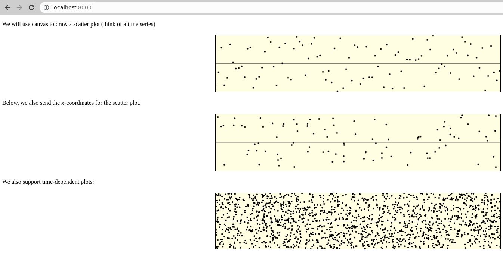

## In-browser plots for Racket

This is a work-in-progress, experimental library that I built mainly for teaching myself scheme and web technology.

The goal of this library is to provide a way to plot data on the browser, from Racket.

As an example, the following scheme code:
```scheme
`((p "We will use canvas to draw a scatter plot (think of a time series)")
   (canvas ((id "fig-1")))
   (style ,(canvas:style #:width 40 #:height 80))
   (p "Below, we also send the x-coordinates for the scatter plot.")
   (canvas ((id "fig-2")))
   (p "We also support time-dependent plots:")
   (canvas ((id "fig-3")))
   (script ,(js:plot (scatter    'fig-1 #:port 8000)
                     (scatter-2d 'fig-2 #:port 8002)
                     (dynamic
                       (scatter-2d 'fig-3 #:port 8002)
                       (with #:refresh-rate 1000)))))
```
generates the HTML page below:

Where the third plot changes with time.
The only new part is the S-expression starting with `js:plot`.

For a more extensive example, check out the source of `test-scatter.rkt`, and run it with: `racket test-scatter.rkt`, then open the url `localhost:8001` with your browser.

